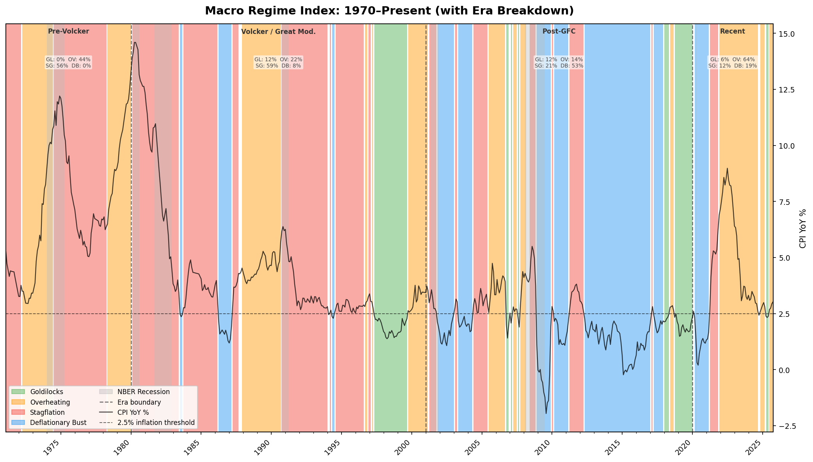
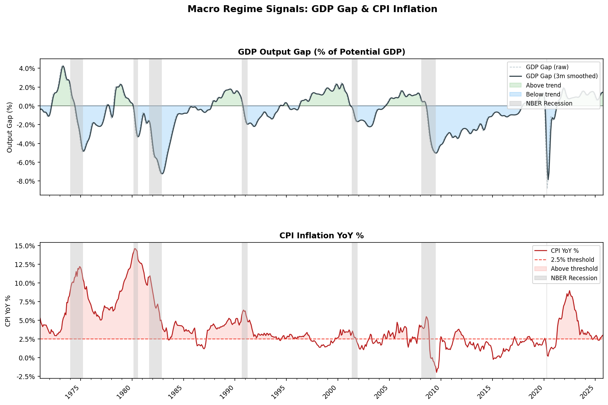
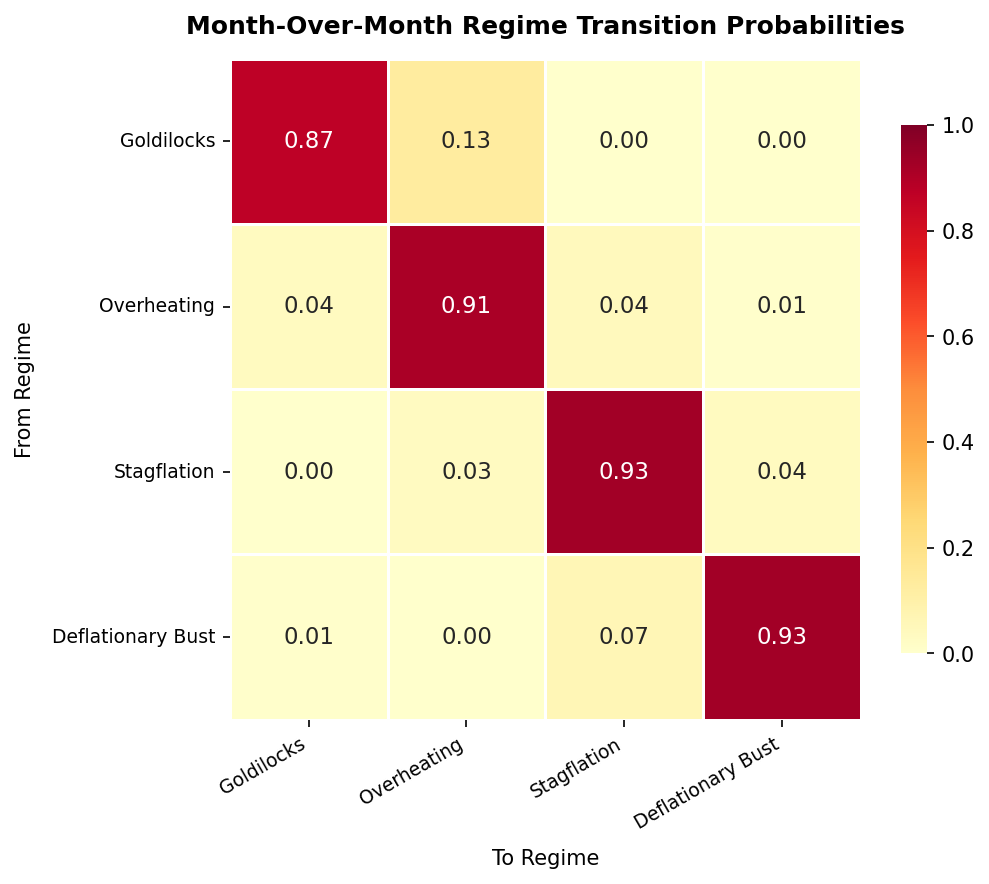

# Greyfield Macro Regime Index (GMRI)


A rules-based index that classifies the US economy monthly into one of four macroeconomic regimes using public Federal Reserve data. Built as the empirical foundation for the **Macro Regime Swap** — a proposed OTC derivative instrument for institutional macro risk management.

---

## Key Findings (January 1971 – September 2025, 657 months)

| Regime | % Time | Avg Duration | Spells | Persistence |
|---|---|---|---|---|
| Goldilocks | 9.3% | 7.4 mo | 10 | 0.87 |
| Overheating | 37.0% | 12.8 mo | 19 | 0.91 |
| Stagflation | 30.6% | 11.2 mo | 18 | 0.93 |
| Deflationary Bust | 21.2% | 13.9 mo | 10 | 0.93 |

**The US economy has spent only 9.3% of the past 54 years in Goldilocks — yet most institutional portfolios are implicitly optimized for it.**

Regime persistence (month-over-month self-transition probabilities of 0.87–0.93) is the core property that makes the Macro Regime Swap viable as a tradeable instrument.

---

## The Four Regimes

| Regime | Growth | Inflation | Canonical Example |
|---|---|---|---|
| **Goldilocks** | Above trend | ≤ 2.5% | Mid-1990s expansion |
| **Overheating** | Above trend | > 2.5% | 2021–2022 post-COVID surge |
| **Stagflation** | Below trend | > 2.5% | 1970s oil shocks |
| **Deflationary Bust** | Below trend | ≤ 2.5% | 2008–2009 GFC |

---

## Methodology

### Data Sources (via FRED API)

| Series | Description | Frequency |
|---|---|---|
| `CPIAUCSL` | Consumer Price Index YoY | Monthly |
| `UNRATE` | Unemployment Rate | Monthly |
| `GDPC1` | Real GDP (chained 2017$) | Quarterly → interpolated monthly |
| `GDPPOT` | Real Potential GDP | Quarterly → interpolated monthly |
| `NROU` | NAIRU (Natural Rate of Unemployment) | Quarterly → interpolated monthly |

### Classification Logic

1. **GDP Gap**: `(Real GDP − Potential GDP) / Potential GDP × 100`, smoothed with a 3-month rolling average
2. **Unemployment Gap**: `UNRATE − NROU` (negative = labor market above trend)
3. **Growth above trend**: GDP Gap > 0 **AND** Unemployment Gap < 0 (both signals must agree — conservative dual-signal AND logic)
4. **Inflation above threshold**: CPI YoY > 2.5% (anchored to Federal Reserve long-run target)
5. **Minimum duration filter**: 3 months — eliminates operationally insignificant blips

Signal conflict rate: only 11.4% of months show disagreement between the two growth signals, validating the AND logic approach.

---

## Robustness

The full `validate/` suite runs 10 independent stress tests including:
- Independent replication (Cohen's κ = 1.000 — perfect deterministic reproduction)
- 60-configuration parameter sensitivity grid
- Structural break testing (Chow test)
- Diagonal transition audit
- Historical event validation
- 10,000-path Monte Carlo payout simulation

---

## Charts

### Regime Timeline (1971–2025)


### Signal Chart — GDP Gap & CPI


### Transition Matrix


---

## White Paper

The full working paper — *The Macro Regime Swap: Instrument Design and Empirical Foundation* — is available in `paper/`. It proposes a novel OTC derivative that allows institutional counterparties to trade macroeconomic regime duration rather than the level of any single variable.

> The white paper is © 2026 Greyfield Labs LLC. All rights reserved. Available for reading and citation only.

---

## Quick Start
```bash
# Install dependencies
pip install -r requirements.txt

# Configure FRED API key
cp .env.example .env
# Edit .env: FRED_API_KEY=your_key_here

# Run
python src/main.py
```

A free FRED API key is available at [fred.stlouisfed.org/docs/api/api_key.html](https://fred.stlouisfed.org/docs/api/api_key.html)

---

## Project Structure